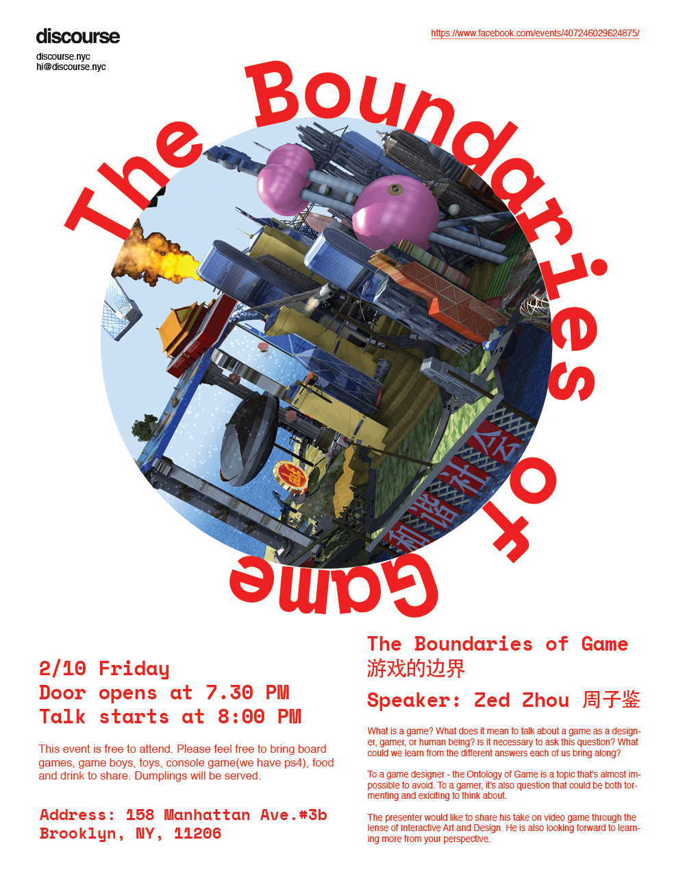

is a pilot practice of alternative education. It promotes empirical and spontaneous exchanges and evokes for a new form of convergence. The project was initiated by Yang Wang and Zhenzhen Qi in 2015, in Brooklyn, New York. Discourse is a place for gathering, a space to play video games, fall asleep, and share breakfast. It nurtures the mundane interactive connectivity, investigates subtle integration of everyday conversational sphere, as well as encourages and traces improvised spoken verse. Discourse expands the forms of thought exchange instead of formal analytical and reactive argument. 

Email: [hi@discourse.nyc](mailto:hi@discourse.nyc)            
微信公众号：zzywbkn         
Related links: [zzyw studio](http://zzywstudio.com)

-----------Upcoming-----------

-----------Past-----------

Cybernetics Roundtable
------------------
2018 Dec 22, Sat. 7:30 PM                
@ discourse

poster credit: Hanwen Zhang & Jiajun

2018春节特别辑 之 『年夜饭』
------------------------
Friday 02/16 2018, 7:30 PM          
@ discourse

 

Discourse Salon: the Boundaries of Game
------------------------
 

"High" Tech
------------------------

Partnered with Anyways      
Dec. 16th, 2016 @ Anyways, 200 Morgan Ave. Brooklyn, NY

 

Artist Talk with NutBrother 坚果兄弟
------------------------
Partnered with Anyways      
Nov. 11th, 2016 @ Anyways, 200 Morgan Ave. Brooklyn, NY

 

