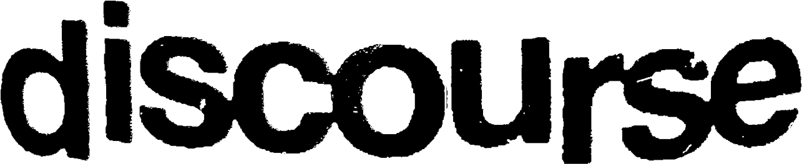
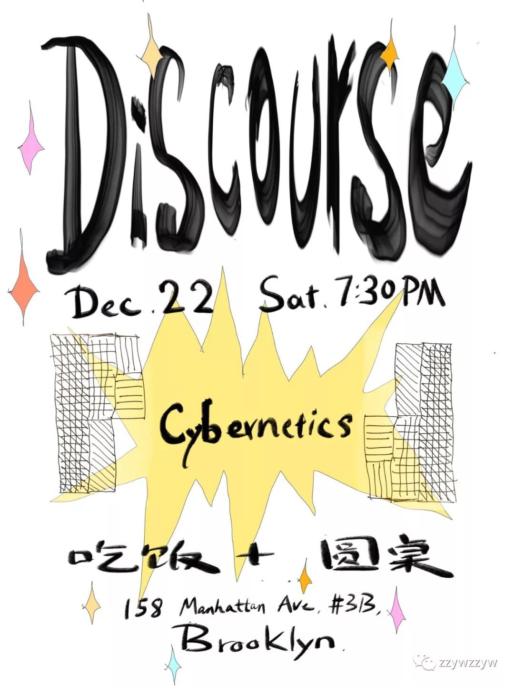
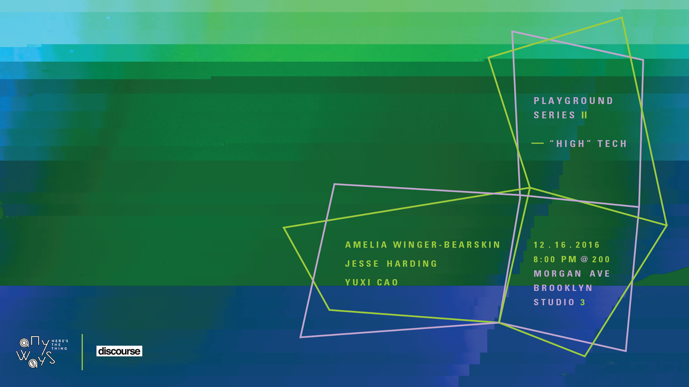

is a pilot practice of alternative education. It promotes empirical and spontaneous exchanges and evokes for a new form of convergence. The project was initiated by Yang Wang and Zhenzhen Qi in 2015, in Brooklyn, New York. Discourse is a place for gathering, a space to play video games, fall asleep, and share breakfast. It nurtures the mundane interactive connectivity, investigates subtle integration of everyday conversational sphere, as well as encourages and traces improvised spoken verse. Discourse expands the forms of thought exchange instead of formal analytical and reactive argument. 

Email: [hi@discourse.nyc](mailto:hi@discourse.nyc)            
微信公众号：zzywbkn         
Related links: [zzyw studio](http://zzywstudio.com)

-----------Upcoming-----------

_Simulated_
-------------

We are glad to announce our collaboration with SLEEPCENTER this summer to present you the _Simulated_ series as part of SLEEPCENTER's 2019 Summer Public Education program.

**More information upcoming soon!**

--------Series introduction----------

It seems in a blink of an eye, from struggling to hear each other from afar, we are finding ourselves being trapped inside a collective feedback loop, having difficulties to tell apart our own voices from the others. What are the metrics enabling such rapidly increasing complex and unstable emergence? Can we recognize the irreducibility of the self?

This public education program – Simulated is an attempt to learn from, reflect on, and create conditions for alternative, simulated realities. As personal computing becomes more accessible to the mass today, we welcome individuals beyond institutional settings to realize their newly acquired “superpower”, by examining the complexity of their immediate reality. Through a series of playful workshops, performances, discussions, and interventions, we hope to transform SLEEPCENTER into a cipher of collective knowledge - a set of intuitive and poetic vocabularies that decrypt the complexity of modernization. 

Simulated will be consisted of six sessions. Each takes on a unique form, such as screening of a curated film series, participatory performance, hackathon, the internet black-market, panel of discussion, and an archival exhibition. The distinctive activities offer perspectives and elements that complement each other’s, allowing us to the attempts to simulate alternative coordinates of perception. 

-----------Past-----------

Cybernetics Roundtable
------------------
2018 Dec 22, Sat. 7:30 PM                
@ discourse

poster credit: Hanwen Zhang & Jiajun

2018春节特别辑 之 『年夜饭』
------------------------
Friday 02/16 2018, 7:30 PM          
@ discourse

 

Discourse Salon: the Boundaries of Game
------------------------
 

"High" Tech
------------------------

Partnered with Anyways      
Dec. 16th, 2016 @ Anyways, 200 Morgan Ave. Brooklyn, NY

 

Artist Talk with NutBrother 坚果兄弟
------------------------
Partnered with Anyways      
Nov. 11th, 2016 @ Anyways, 200 Morgan Ave. Brooklyn, NY

 

